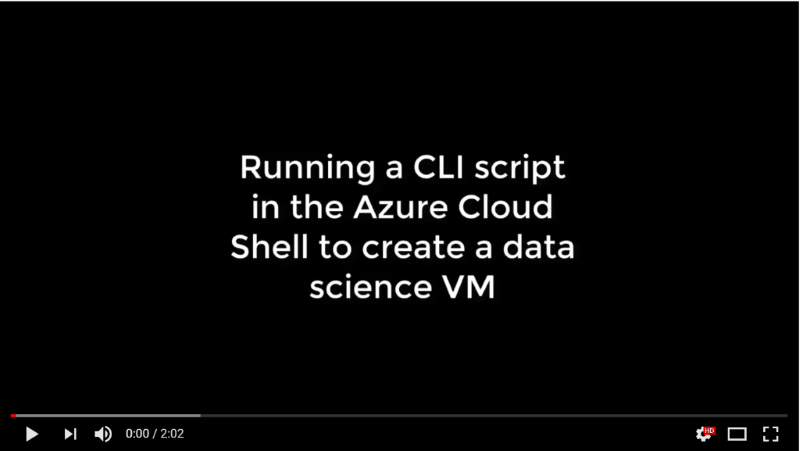

# data-science - CLI
Azure CLI/bash scripts related to data science

_create_ds_vm.sh_

Example bash script which uses [Azure CLI 2.0](https://docs.microsoft.com/cli/azure/get-started-with-azure-cli?view=azure-cli-latest) to automate creation of Microsoft Windows 2016 [Data Science VM](https://docs.microsoft.com/azure/machine-learning/data-science-virtual-machine/overview). This script takes the following command line arguments: virtual machine name, resource group name, data center location, VM size (small, medium or large), user and password. The Azure resource group is created if does not already exist. This script can be run directly from the Azure Portal in an [Azure Cloud Shell](https://azure.microsoft.com/features/cloud-shell/).

<<<<<<< HEAD
Here's a short video (no audio) showing an example of running this script in the Azure Cloud Shell: 
=======
Here's a short video showing an example of running this script in the Azure Cloud Shell: 
>>>>>>> 3745759c935459c66d77f4755cdbd99fa95cfa1c

